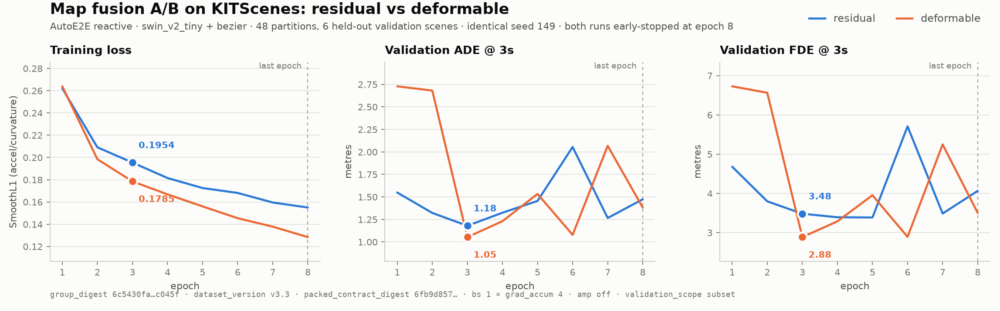

# Running comparable training runs

How to train an AutoE2E variant on KITScenes on one workstation and get a number
that can be put next to somebody else's. Written for
[issue #168](https://github.com/autowarefoundation/auto_e2e/issues/168).

The short version: **use `train_il`, do not write a training loop.** Numbers from
a custom loop cannot be compared with anyone else's, and most of the spread in
the issue thread comes from that rather than from architecture.

---

## 1. What makes two runs comparable

Three digests, all printed by the run itself. Two runs compare only if all three
match:

| Field | Where it comes from | Why it matters |
|---|---|---|
| `group_digest` | `Validation split: … group_digest=…` log line | same held-out scenes |
| `dataset_version` | packed `manifest.json` | same packing contract |
| `packed_contract_digest` | packed `manifest.json` | same sample construction |

Plus the settings that silently change what is trained: `backbone`,
`map_fusion_mode`, `planner_mode`, `amp`, and effective batch
(`batch_size × grad_accum_steps`).

Report all of it next to any ADE/FDE. Same digests → the numbers can sit side by
side. Different → they cannot.

> **The metric is ADE/FDE at 3 s.** That is what the official KITScenes benchmark
> scores (`kitscenes_benchmark` hard-requires horizons `(3, 5)`), and what
> `train_il` validates on. 5 s comes from the benchmark task; the training loop
> also records 1 s and 2 s.

---

## 2. Setup, once

**Python 3.12** — the pinned `pyproj==3.7.2` needs ≥3.11.

```bash
conda create -y -n auto_e2e python=3.12
conda activate auto_e2e
pip install torch==2.7.1 --index-url https://download.pytorch.org/whl/cu128
pip install -r requirements.txt mlflow huggingface_hub
```

The packing path needs two packages that are **not** in `requirements.txt`:

```bash
git clone https://github.com/KIT-MRT/kitscenes.git
pip install -e kitscenes --no-deps          # --no-deps: the SDK pins numpy<2
pip install kitscenes/res/ml_converter_wheels/lanelet2-1.2.2-cp312-*.whl
pip install "opencv-python-headless>=4.10"  # the SDK's <4.10 pin is built for numpy 1.x
```

Without `lanelet2` the map tiles silently become zero tensors — the run looks
healthy and trains on blank maps.

Build the native rasterizer:

```bash
python Model/navigation/native/build.py
```

**If ROS 2 is installed**, its `PYTHONPATH` breaks the environment. Prefix every
command with `env -u PYTHONPATH`.

Checkpoints upload through boto3, so a local S3 endpoint is needed. An in-memory
mock is not enough — each checkpoint is ~890 MB:

```bash
docker run -d --name minio-autoe2e -p 9000:9000 -v $PWD/minio-data:/data \
  -e MINIO_ROOT_USER=autoe2e -e MINIO_ROOT_PASSWORD=autoe2e123 \
  minio/minio server /data

export AWS_ACCESS_KEY_ID=autoe2e AWS_SECRET_ACCESS_KEY=autoe2e123
export AWS_ENDPOINT_URL=http://localhost:9000 AWS_DEFAULT_REGION=us-east-1
python -c "import boto3; boto3.client('s3').create_bucket(Bucket='autoe2e-checkpoints')"
```

**Dataset access.** `KIT-MRT/KITScenes-Multimodal` is gated. Accept the terms on
the dataset page *and* use a token with global gated-repo read — a fine-grained
token scoped to your own namespace returns 403 on someone else's repo.

---

## 3. Get the data

The full train split is **2,619 GB** across 533 archives (mean 4.91 GB), so
extract → pack → delete one scene at a time. Packed output is ~181× smaller:
measured here, 60 scenes are 272 GB raw and **1.5 GB packed**.

Pin the revision. The contract expects `6fde0034…`; HuggingFace `main` has moved
past it and `data_ingest` rejects anything else.

```python
from huggingface_hub import hf_hub_download
hf_hub_download(
    "KIT-MRT/KITScenes-Multimodal", "data/train/<scene>.tar",
    repo_type="dataset", revision="6fde0034446669e2ed7235e4c7fe323cd23d599d",
    local_dir="raw",
)
```

Extract into the HuggingFace layout `<root>/data/train/<scene>/` — `data_processing`
hardcodes `split="train"`. Then pack **one scene per partition** (calibration and
map state are scene-scoped, so a multi-scene partition raises), using the
KITScenes navigation dataset version, *not* the `DATASET_PACK_VERSION` default:

```python
data_processing.task_function(
    raw_data=FlyteDirectory(path=str(dataset_root)),
    dataset=Dataset.KITSCENES,
    source_revision=KITSCENES_SOURCE_REVISION,
    dataset_version=KITSCENES_NAVIGATION_DATASET_VERSION,   # v3.3, not v2.2
    hz=10, image_size=256, world_model=False,
    group_ids=[scene_id],
)
```

**How many scenes?** `val_fraction` is pinned at 0.1 by the frozen manifest, so
the validation set is 10% of your partitions — 14 partitions gives a single
validation scene, which makes ADE hostage to one scene's traffic. 60 partitions
gives 6. Measured cost at ~110 MB/s: 60 scenes ≈ 45 min download + 25 min pack.

Not every scene yields samples. A sample needs 64 history + 1 + 64 future frames,
so a scene needs 129 consecutive good frames (12.9 s at 10 Hz); 129 of the 533
scenes yield nothing. The navigation quality audit then drops more — of 60 packed
partitions, 56 were non-empty and 48 survived the audit.

---

## 4. Run it

Runs are declared in [`Tools/experiments/experiments.yaml`](../Tools/experiments/experiments.yaml).
Everything under `shared` is held constant; entries under `runs` differ only in
the axes named there.

```yaml
shared:
  epochs: 20
  batch_size: 1
  grad_accum_steps: 4     # effective batch 4; batch-1 gradients are too noisy
  amp: false              # fp16 made the GradScaler skip every optimizer step
  validation_scope: subset

runs:
  - name: ab_deformable
    backbone: swin_v2_tiny
    map_fusion_mode: deformable
    planner_mode: bezier
    seed: 149
```

```bash
env -u PYTHONPATH python Tools/experiments/run_experiment.py --list
env -u PYTHONPATH python Tools/experiments/run_experiment.py \
    --run ab_deformable --packed /path/to/packed
```

**One training process at a time.** A 16 GB card fits exactly one; a second
silently OOMs the first partway through.

Before spending a night, check the model builds in your chosen configuration —
this needs no data and takes seconds:

```bash
python Tools/smoke_forward_pass.py --map_fusion_mode deformable --backbone swin_v2_tiny
```

---

## 5. Plot and report

```bash
python Tools/experiments/plot_runs.py run_a.log run_b.log \
    --labels residual deformable -o comparison.png \
    --provenance "group_digest … · dataset_version v3.3 · packed_contract_digest …"
```

Three panels, never one chart with two y-axes: loss and displacement live on
different scales, and a second axis turns the scaling into an apparent
relationship.

---

## 6. Which combinations have been tested

Measured on 48 partitions / 6 validation scenes, `group_digest 6c5430fa…`,
seed 149, batch 1×4, amp off. **Subset-scope numbers compare to each other, not
to full-corpus runs.**

| Backbone | Map fusion | Planner | Status | Best ADE@3s | Best FDE@3s | Throughput |
|---|---|---|---|---|---|---|
| swin_v2_tiny | residual | bezier | ✅ tested | 1.179 m | 3.481 m | 10.36 /s |
| swin_v2_tiny | deformable | bezier | ✅ tested | **1.053 m** | **2.885 m** | 8.57 /s |
| swin_v2_tiny | cross_attn | bezier | ⛔ blocked | — | — | — |
| swin_v2_tiny | residual | flow_matching | ⚠️ not meaningful | — | — | — |
| swin_v2_tiny | deformable | flow_matching | ⚠️ not meaningful | — | — | — |
| swin_v2_tiny | cross_attn | flow_matching | ⛔ blocked | — | — | — |
| conv_next_v2_tiny | residual | bezier | ⬜ untested | — | — | — |
| conv_next_v2_tiny | deformable | bezier | ⬜ untested | — | — | — |
| conv_next_v2_tiny | cross_attn | bezier | ⛔ blocked | — | — | — |
| conv_next_v2_tiny | * | flow_matching | ⚠️ not meaningful | — | — | — |
| res_net_50 | residual | bezier | ⬜ untested | — | — | — |
| res_net_50 | deformable | bezier | ⬜ untested | — | — | — |
| res_net_50 | cross_attn | bezier | ⛔ blocked | — | — | — |
| res_net_50 | * | flow_matching | ⚠️ not meaningful | — | — | — |

**⛔ `cross_attn` is blocked at the contract resolution.** It is dense O(N²)
attention and `MapCrossAttentionFusion.forward` raises above 4096 BEV tokens; the
KITScenes grid is 256×256 = 65,536. Use `deformable` for attention-based fusion.

**⚠️ `flow_matching` runs but optimizes the wrong objective.** `train_il`
SmoothL1-regresses the planner output while `FlowMatchingPlanner.forward`
Euler-integrates from fresh noise each step — that is not the velocity-MSE flow
objective, so it converges toward the conditional mean. `build_planner` emits a
`RuntimeWarning` saying so. The correct loss exists in `compute_planner_loss` but
is not wired into the training loop. Numbers from these cells look valid and are
not.

So of the 12 cells in the issue's matrix, **6 are trainable as specified** and 2
are done.

### What the two completed runs actually showed

The difference between them is **smaller than the epoch-to-epoch noise inside
either run** — deformable alone swings from 1.05 to 2.07 m ADE. With one seed and
six validation scenes this is not a demonstrated effect; the honest statement is
that deformable is not worse and costs 17% throughput.

Both runs early-stopped at epoch 8 with their best at epoch 3, while training
loss kept falling (0.26 → 0.13). That gap is overfitting, and it appeared
identically under both fusions — at 48 scenes the limiting factor is data
quantity, not architecture.



---

## 7. Things that cost people a day

| Symptom | Cause |
|---|---|
| `ModuleNotFoundError: lark` / odd pytest plugin errors | ROS 2 on `PYTHONPATH` — use `env -u PYTHONPATH` |
| `Could not find a version that satisfies pyproj==3.7.2` | Python < 3.11 |
| `navigation rasterizer shared library is missing` | run `Model/navigation/native/build.py` |
| `validation manifest dataset version does not match packed shards` | packed with `DATASET_PACK_VERSION` (v2.2) instead of v3.3 |
| `requested val_fraction differs from the frozen validation manifest` | `val_fraction` must be 0.1 |
| `MlflowException: filesystem tracking backend … maintenance mode` | use `sqlite:///path/mlflow.db`, not `file://` |
| `KeyError: 'MLFLOW_TRACKING_URI'` | read as bare `os.environ[...]`, no default |
| Checkpoint upload fails / STS error | set `AUTO_E2E_CHECKPOINT_BUCKET` and `AWS_ENDPOINT_URL` |
| CUDA OOM mid-run | a second training process on the same GPU |
| Loss perfectly flat, run looks fine | `amp=true` — the GradScaler skips every step |
